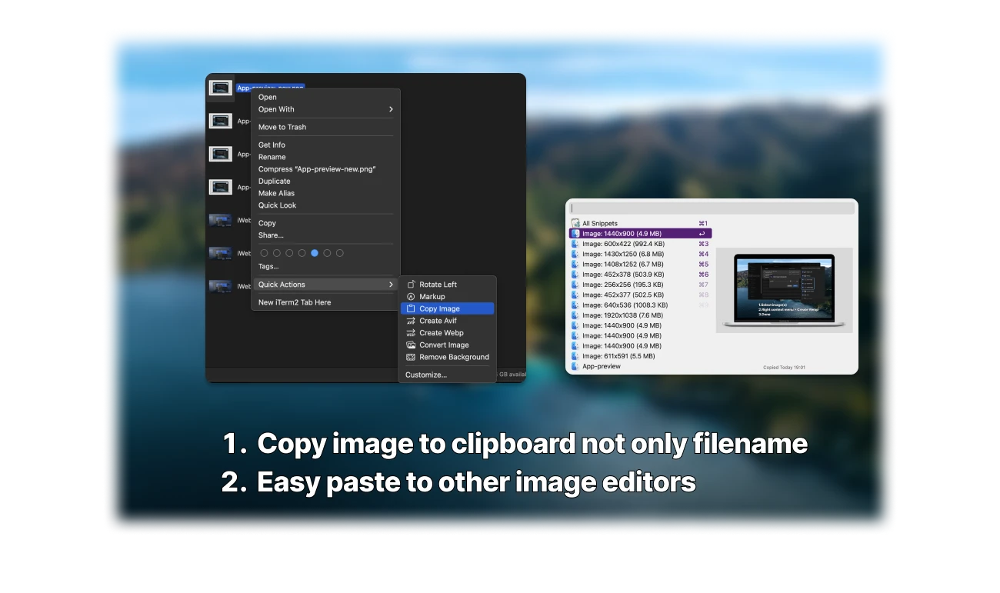
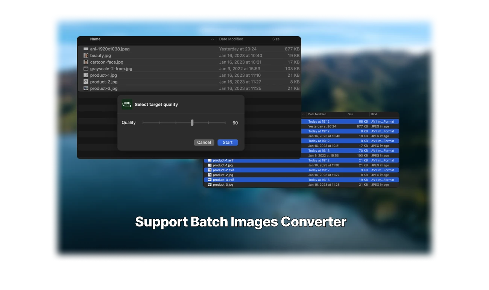

# README.md
- [Deutsch](README.de.md)
- [English](README.md)
- [Spanish](README.es.md)
- [French](README.fr.md)
- [Italian](README.it.md)
- [언어](README.ko.md)
- [日本語](README.ja.md)
- [简体中文](README.zh_cn.md)
- [繁体中文](README.zh_tw.md)

# iWebp - Bilder in Webp konvertieren
  
Laden Sie [das neueste Release aus dem macOS App Store herunter](https://apps.apple.com/us/app/id1663442012)
  
V2.1  
---  
- Entfernung der Firebase-Analytik  
- Fehlerbehebungen und Leistungsverbesserungen
  
V2.0.1  
---  
- Fehlerbehebungen und Leistungsverbesserungen
  
V2.0  
---  
- Unterstützung der Konvertierung in das .avif-Format  
- Unterstützung des Kopierens von Bildern in die Zwischenablage, ohne den Dateinamen zu kopieren
  
V1.1  
---  
- Unterstützung der Konvertierung von .gif-animierten Bildern in animierte Webp-Bilder
  
V1.0  
---  
- Einfache Stapelkonvertierung von Bildern in das .webp-Format  
- Einfache Stapelkonvertierung von Bildern in das .avif-Format  
- Schnellaktion zum Kopieren von Bildern, nicht des Dateinamens, in die Zwischenablage des Systems, um sie schnell in andere Anwendungen einzufügen  
- Wahrung der Privatsphäre, es ist nicht erforderlich, Bilder hochzuladen
  
Verwendung:  
   
1. Bilder auswählen  
2. Rechtsklick -> Webp erstellen  
3. Zielschärfe auswählen  
4. Fertig  
  
## Funktionen  
  
  
  
  
  
  
## Aktivieren von iWebp in den macOS-Einstellungen  
  
  
  
  
## Vorschau von iWebp in macOS  
